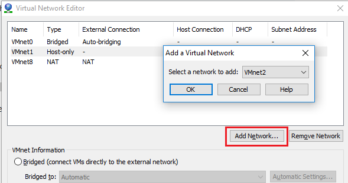
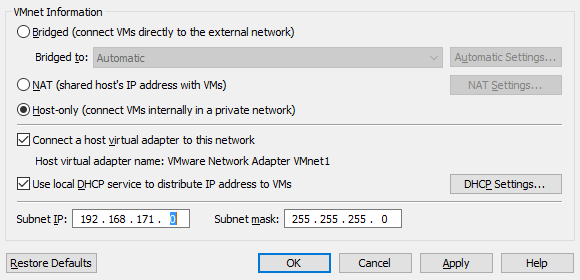
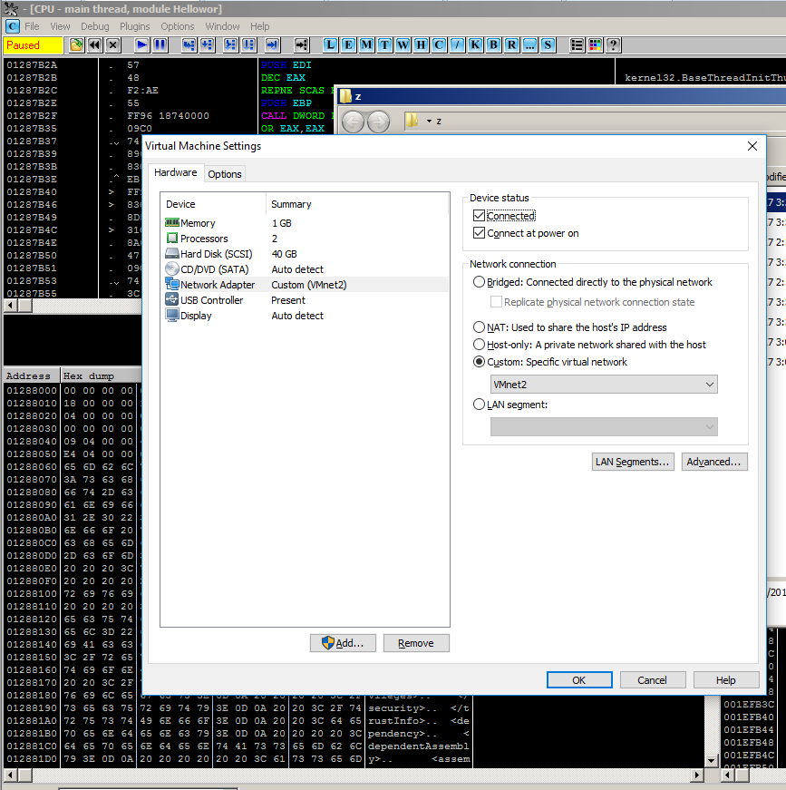
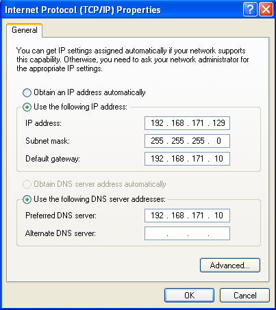
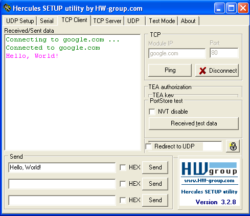
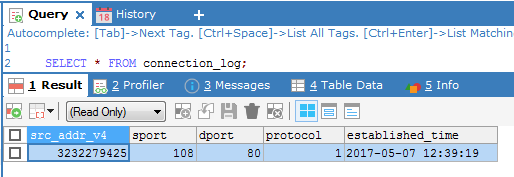
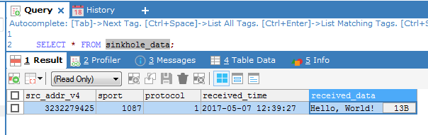

# Cài đặt internet gateway để giám sát các hành vi của mã độc
## TL;DR
Trong khi phân tích mã độc (malware), người phân tích luôn gặp một số tình huống khó chịu như: mã độc cần có kết nối tới server điều khiển, hoặc mã độc sẽ kiểm tra kết nối tới một số server trước khi thực hiện hành vi độc hại. Việc kiểm tra những đoạn mã liên quan tới kết nối và giao tiếp với server thật sự rất khó khăn. Do đó, tôi nghĩ tới một phương pháp có thể giám sát và kiểm tra tất cả các dữ liệu được gửi tới server và đưa chúng vào database. Bằng phương pháp này, chúng ta có thể biết được chính xác thứ malware gửi ra ngoài nhưng không cần thiết phải dịch ngược (reverse engineering) quá nhiều.

## Cài đặt môi trường phân tích
Tôi dùng VMware để xây dựng hệ thống phân tích của mình. VirtualBox và các loại máy ảo khác có lẽ cùng dùng được. Cần tối thiểu hai máy tính, một máy windows và một máy linux. Hai máy này kết nối được với nhau.
Tôi tạo thêm một card mạng ảo để 2 máy có thể giao tiếp với nhau qua một mạng ảo:<br />

<br />


Tôi thêm card mạng ảo đó vào cả hai máy.<br />


## Cài đặt gateway
Tôi sử dụng hệ điều hành Ubuntu và cấu hình nó thành một gateway. Có thể sử dụng bất cứ một hệ điều hành nào khác thuộc họ unix cũng được: Centos,Debian,...Đâykhông phải là một gateway thật sự nhưng nó có nhiệm vụ nhận mọi gói tin được gửi tới mọi địa chỉ có thể được.

Tôi có 2 card mạng, ens33 để tôi có thể sử dụng SSH và ens38 để nhận các gói tin từ máy tính phân tích malware gửi tới.

``` bash
root@ubuntu:~# ip a
1: lo: <LOOPBACK,UP,LOWER_UP> mtu 65536 qdisc noqueue state UNKNOWN group default qlen 1
    link/loopback 00:00:00:00:00:00 brd 00:00:00:00:00:00
    inet 127.0.0.1/8 scope host lo
       valid_lft forever preferred_lft forever
    inet6 ::1/128 scope host
       valid_lft forever preferred_lft forever
2: ens33: <BROADCAST,MULTICAST,UP,LOWER_UP> mtu 1500 qdisc pfifo_fast state UP group default qlen 1000
    link/ether 00:0c:29:b5:d2:bf brd ff:ff:ff:ff:ff:ff
    inet 192.168.66.201/24 brd 192.168.66.255 scope global ens33
       valid_lft forever preferred_lft forever
    inet6 fe80::20c:29ff:feb5:d2bf/64 scope link
       valid_lft forever preferred_lft forever
3: ens38: <BROADCAST,MULTICAST,UP,LOWER_UP> mtu 1500 qdisc pfifo_fast state UP group default qlen 1000
    link/ether 00:0c:29:b5:d2:c9 brd ff:ff:ff:ff:ff:ff
    inet 192.168.171.10/24 brd 192.168.171.255 scope global ens38
       valid_lft forever preferred_lft forever
    inet6 fe80::20c:29ff:feb5:d2c9/64 scope link
       valid_lft forever preferred_lft forever
```

Tôi cấu hình iptables để chuyển hướng toàn bộ kết nối từ bất cứ một cổng nào tới một cổng cố định, ví dụ như 9999.
``` bash
iptables -t nat -A PREROUTING -i ens38 -p tcp --dport 1:65535 -j LOG --log-prefix "INPUT:SINKHOLE:" --log-level 6
iptables -t nat -A PREROUTING -i ens38 -p tcp --dport 1:65535 -j REDIRECT --to-ports 9999
```
Sau đó, tôi lại chuyển toàn bộ log của iptables về server của tôi để xử lý ở bước sau. Tôi tạo một file mới trong thư mục `/etc/rsyslog.d/`. Làm giống nhưu ví dụ  trong file `20-ufw.conf`, tôi tạo một file có tên `/etc/rsyslog.d/00-sinkhole.conf` và chứa nội dung như sau:

```
:msg, contains, "INPUT:SINKHOLE:"         @@127.0.0.1:10514
& ~
```
lưu ý rằng tên file khá quan trọng, do hệ thống sẽ sắp xếp các luật trong file theo tên file. Với tên file bắt đầu là **00**, hệ thống sẽ lấy luật trong file này và đặt trước luật trong tên file bắt đầu là **01**.

## Syslog server, sinkhole server
Trong server này, tôi tích hợp 3 module khác nhau, được xây dựng dựa trên thư viện twisted.
 - DNSServerFactory: một dns server và luôn trả về địa chỉ của sinkhole server cho bất cứ domain nào. Truy vấn DNS sẽ được lưu vào database.
 - SyslogdProtocol: một server có nhiệm vụ nhận và xử lý log từ rsyslog gửi tới. Đó là các log sinh ra trong quá trình chuyển hướng kết nối của iptables. Kết quả là địa chỉ IP và cổng khởi tạo kết nối sẽ được lưu lại. Bằng cách này, ta có thể biết chính xác client nào gửi dữ liệu gì.
 - SinkholeServer: một server có nhiệm vụ nhận tất cả dữ liệu mà malware gửi tới và ghi vào database.
 - DatabaseConnector: nhằm giao tiếp với cơ sở dữ liệu mysql.

Tôi cài đặt thêm một số gói cần thiết trước khi chạy server:
``` bash
apt-get install python python-dev python-pip libmysqlclient-dev mysql-client
pip install twisted MySQL-python
```

Sau đó, chúng ta chạy [sinkhole server](sinkhole-server/sinkhole.py) và kiểm tra database. Trong lần chạy đầu tiên, bạn nên có tham số **-i** để khởi tạo database:
``` bash
python sinkhole.py -i
```
Cuối cùng, tôi khởi dộng lại dịch vụ rsyslog. `rsyslog` sẽ chuyển mọi dòng log có chứa **"INPUT:SINKHOLE:"** tới server của tôi.
``` bash
service rsyslog restart
```

**Lưu ý:** Vì cổng 53 là một "privileged" port, có nghĩa là bạn cần chạy server với quyền root thì mới có thể lắng nghe ở cổng 53. Nếu không muốn dùng quyền root, bạn nên để cổng DNS là một cổng khác và dùng iptables để chuyển hướng kết nối.

## Kết quả
Tôi tiến hành cấu hình địa chỉ IP trên máy windows như sau:<br />


Và tôi dùng một công cụ đơn giản để gửi một request tới địa chỉ **google.com:80**. Có thể dùng nc nhưng tôi lại thích màu mè.<br />


Sau đó, kiểm tra trong cơ sở dữ liệu:

Bạn có thể thấy chúng ta nhận được lệnh truy vấn dns để phân giải tên miền **google.com**<br />


Sau đó là một kết nối được mở tới server giả của tôi:<br />


Cuối cùng là nội dung mà client đã gửi đi **Hello, World!**:<br />


## Kết luận
Bài này viết đã cho các bạn một chút hình dung về phương pháp phân tích hành vi độc hại của mã độc. Bạn có thể cài đặt một phòng lab nhỏ ở nhà để tự minh thử nghiệm. Trong thời gian tới, tôi sẽ viết một số bài viết liên quan tới các kinh nghiệm trong việc xử lý những tình huống mã độc cụ thể trong thực tế, cũng như cung cấp một bức tranh toàn diện hơn về những hành vi thực sự của mã độc và cách để giảm thiểu chúng.

## Tham chiếu
https://superuser.com/questions/440324/iptables-how-to-forward-all-external-ports-to-one-local-port
http://fibrevillage.com/sysadmin/202-enable-linux-iptables-logging
https://askubuntu.com/questions/348439/where-can-i-find-the-iptables-log-file-and-how-can-i-change-its-location
http://stackoverflow.com/questions/37034439/rsyslog-filtering-and-forwarding
http://stackoverflow.com/questions/413807/is-there-a-way-for-non-root-processes-to-bind-to-privileged-ports-on-linux
